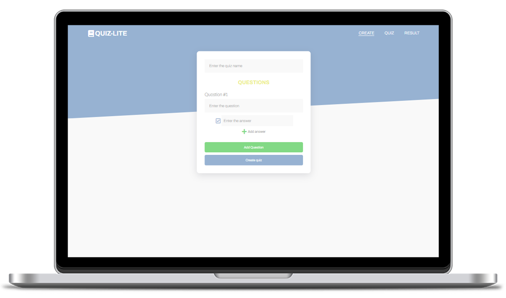
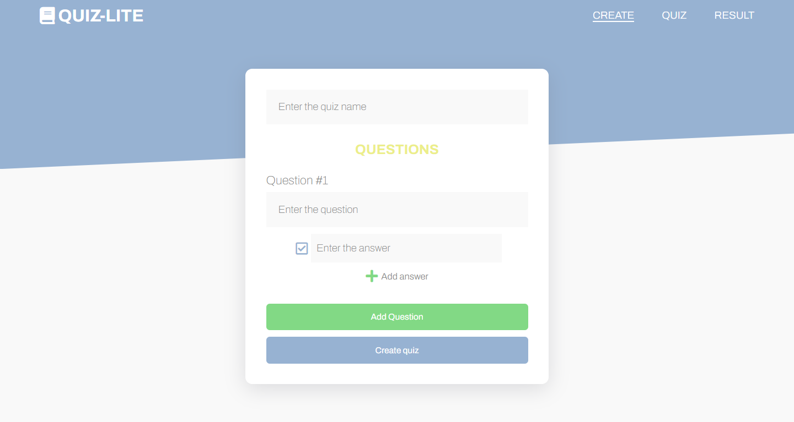
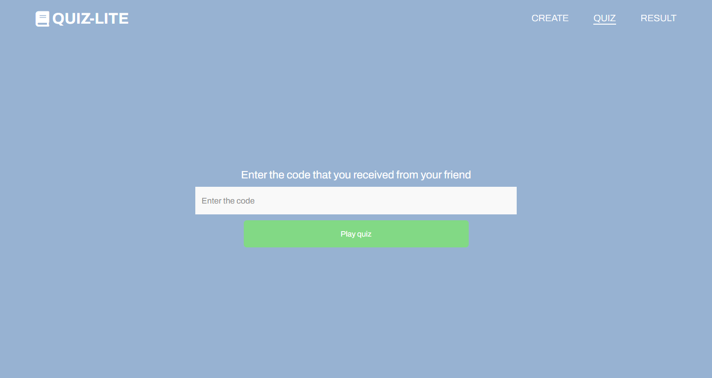
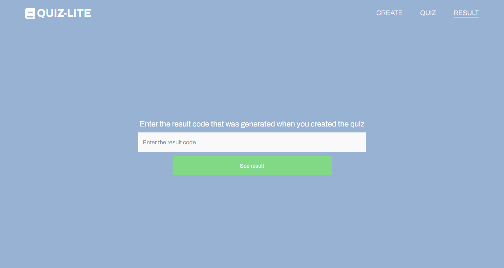
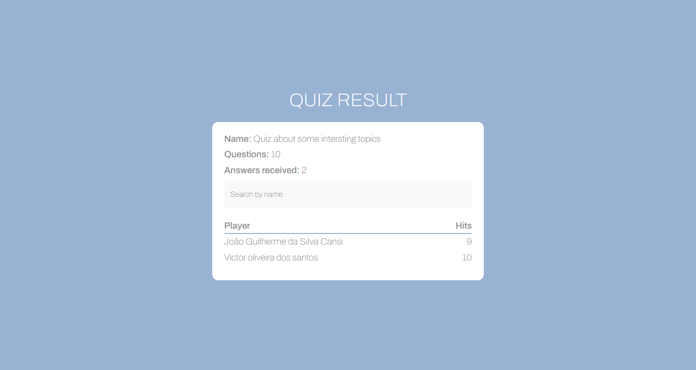
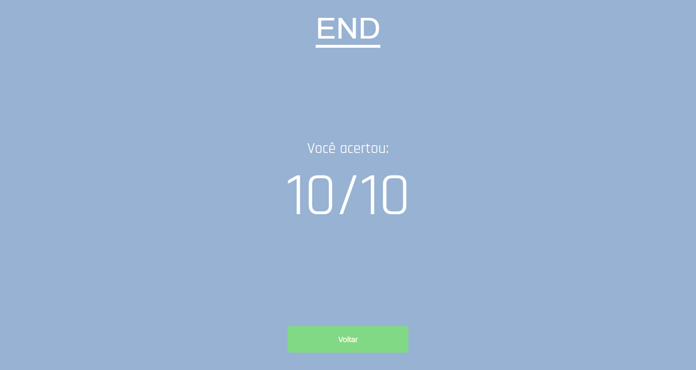
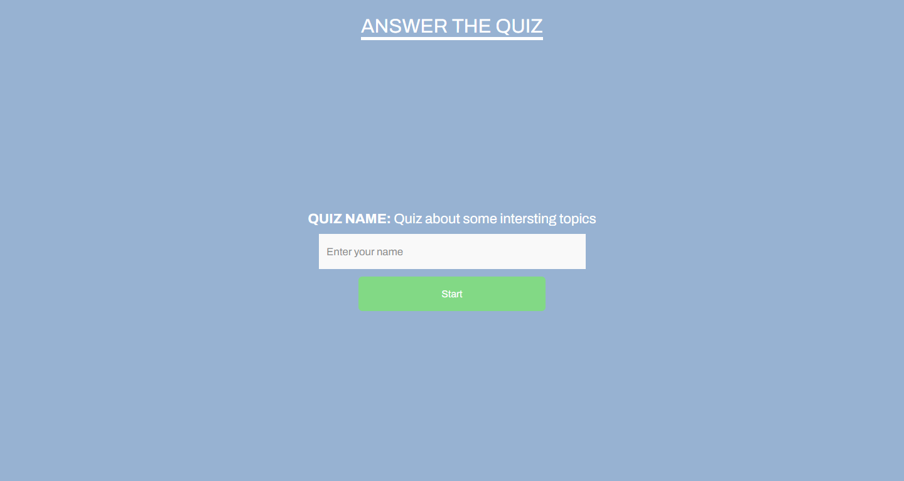
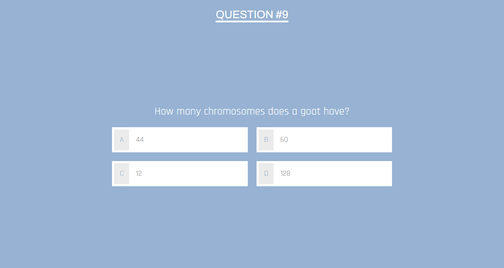

<h1 align="center">
  
</h1>

  <a href="#-techs">✨ Techs</a>&nbsp;&nbsp;&nbsp;|&nbsp;&nbsp;&nbsp;
  <a href="#-project">💻 Project</a>&nbsp;&nbsp;&nbsp;|&nbsp;&nbsp;&nbsp;
  <a href="#-layout">🔖 Layout</a>&nbsp;&nbsp;&nbsp;|&nbsp;&nbsp;&nbsp;
  <a href="#-how-to-start">🚀 How to start</a>&nbsp;&nbsp;&nbsp;

  

    

## ✨ Techs

This project was created using this following technologies:

- [React](https://reactjs.org)
- [Nodejs](https://nodejs.org/)
- [TypeScript](https://www.typescriptlang.org/)

## 💻 Project

This project allows you to create and play quizzes. You'll be able to create your own, play others quizzes and check the result of your own quiz. 

## 🔖 Layout

  

  

  

  

  

  

  

## 🚀 How to start

- Clone this repository
- Start postgres database (you'll need Docker):
  - `docker-compose up`
- Back-end:
  - `cd server`
  - `yarn typeorm:dev migration:run`
  - `yarn start:dev`
- Front-end: 
  - `cd client`
  - `yarn start`

Now you can access [`localhost:3000`](http://localhost:3000) in your browser.
